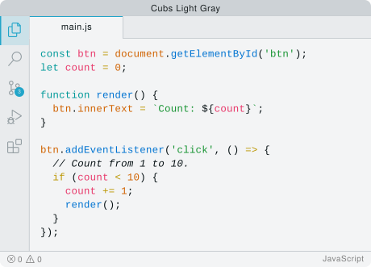
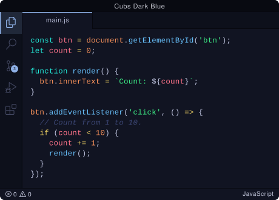
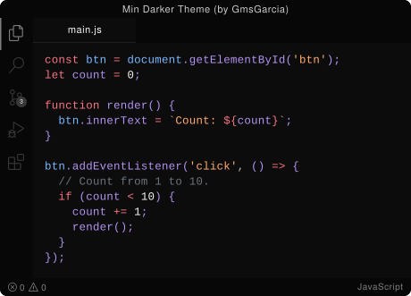

<div align="center">


# Cubs Theme

A minimal VS Code theme with three variants — Midnight, Light and Shadow.

[](https://vscode.dev/theme/nuelst.cubs-theme)

</div>

## Variants

- **Light** — Clean light gray base (`#f3f4f5`) with teal accents, optimized for bright environments



- **Midnight** — Deep dark blue base (`#111422`) with soft blue accents



- **Shadow** — Pure black base (`#0C0C0C`) with subtle gray tones, for minimal distraction



## Installation

1. Install from the [Marketplace](https://marketplace.visualstudio.com/items?itemName=nuelst.cubs-theme)
2. Open the Color Theme picker:
   - **Windows / Linux:** `Ctrl+K` then `Ctrl+T`
   - **macOS:** `Cmd+K` then `Cmd+T`
3. Choose **Light**, **Midnight** or **Shadow**

Or via CLI:

```bash
code --install-extension nuelst.cubs-theme
cursor --install-extension nuelst.cubs-theme
```

## Development

```bash
git clone https://github.com/nuelst/cubs-theme
cd cubs-theme
pnpm install
```

Press `F5` in VS Code to launch the Extension Development Host.

## Local Build & Install

```bash
pnpm run package
code --install-extension cubs-theme-1.0.1.vsix
cursor --install-extension cubs-theme-1.0.1.vsix
```

## License

[MIT](LICENSE)