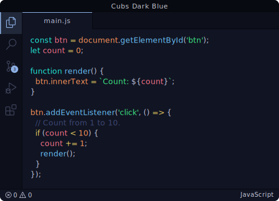
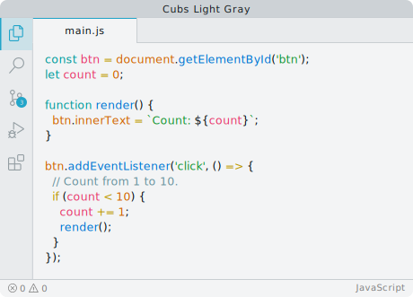

<div align="center">


# Cubs Theme

A minimal theme for VS Code that comes in dark blue and light gray.

[](https://vscode.dev/theme/nuelst.cubs-theme)

</div>

## Variants

- **Cubs Dark Blue** — Deep dark blue base (`#111422`) with soft blue primary accents



- **Cubs Light Gray** — Clean light gray base (`#f3f4f5`) with teal primary accents, optimized for bright environments




## Installation

1. Install the theme from the [Marketplace](https://marketplace.visualstudio.com/items?itemName=nuelst.cubs-theme).
2. Open the Color Theme picker:
   - **Windows / Ubuntu:** `File > Preferences > Color Theme` or press `Ctrl+K` then `Ctrl+T`
   - **macOS:** `Code > Preferences > Color Theme` or press `Cmd+K` then `Cmd+T`
3. Choose **Cubs Dark Blue** or **Cubs Light Gray**.

Alternatively install via CLI:

```bash
code --install-extension nuelst.cubs-theme
```

## Manual Installation (Development)

```bash
git clone https://github.com/nuelst/cubs-theme
cd cubs-theme
```

Open the folder in VS Code and press `F5` to launch the Extension Development Host.

## Local Package + Install

```bash
pnpm install
pnpm run package
cursor --install-extension cubs-theme-0.0.1.vsix
code --install-extension cubs-theme-0.0.1.vsix
```

## License

[MIT License](LICENSE)
